# 202130311 안상하 

## 2025.04.18 보강
**한번 더 state 끌어올리기**
* `Game` 컴포넌트 안에 `state` 추가
~~~js
//Game.js
export default function Game() {
    const [xIsNext, setXIsNext] = useState(true);
    const [history, setHistory] = useState([Array(9).fill(null)]);
 //...
}
~~~

* 현재 플레이 대한 `square`을 렌더링하려면 `history`에서 마지막 `squares`의 배열을 읽어야 함
* 계산할 수 있는 충분한 정보가 있기 때문에 `usestate`는 필요하지 않음
~~~js
//Game.js
export default function Game() {
    const [xIsNext, setXIsNext] = useState(true);
    const [history, setHistory] = useState([Array(9).fill(null)]);
    const currentSquares = history[history.length - 1];
// ...
}
~~~
* `Game` 컴포넌트 안의 `Board` 컴포넌트가 게임을 업데이트할 때 호출할 `handlePlay` 함수 생성
* `xIsNext`, `currentSquares`, `handlePlay` 를 `Board` 컴포넌트에 `props`로 전달 
~~~js
//Game.js
export default function Game() {
  ...

  function handlePlay(nextSquares) {
    // TODO
  }

  return (
    

        

          <Board xIsNext={xIsNext} squares={currentSquares} onPlay={handlePlay}
//...
  )
~~~

* `Board` 컴포넌트가 `xIsNext`, `squares`, `onPlay` 함수를 `props`로 받을 수 있도록 변경
* `Board`함수에서 `useState`호출하는 처음 두 줄 제거
~~~js
//Game.js
function Board({ xIsNext, squares, onPlay }) {  
    function handleClick(i) {
//...
    }
    //...
}
~~~

* `Board` 컴포넌트의 `handleClick`에 있는 `setSquares` 및 `setIsNext` 호출을 새로운 `onPlay`함수에 대한 단일 호출로 대체
~~~js
//Game.js
if (xIsNext) {
        nextSquares[i] = "X";
      } else {
        nextSquares[i] = "O";
      }
       onPlay(nextSquares)
    }
~~~

* `Game`컴포넌트에서 `handlePlay`함수 구현
* `setSquares`함수 대신 `history` `state` 변수 사용
* `squares` 배열을 새 `history`항목으로 추가하여 `history`업데이트 및
`xIsNext` 값 반전
~~~js
//Game.js
function handlePlay(nextSquares) {
      setHistory([...history, nextSquares]);
      setXIsNext(!xIsNext);
    }
 //...
~~~

* `[...history, nextSquares]`는 `history`에 있는 모든 항목을 포함하는 새 배열을 만들고 그 뒤에 `nextSquares` 생성
* `...history` 전개 구문을 사용하면 `"history 의 모든 항목 열거"`로 읽을 수 있음

**과거 움직임 보여주기**
* `<button>` 같은 React 엘리먼트는 일반 JavaScript 객체이므로 애플리케이션에서 전달 가능
* React에서 여러 엘리먼트를 렌더링하려면 React 엘리먼트 배열 사용
* 이미 state에 이동 history 배열이 있기 때문에 이것을 React 엘리먼트 배열로 변환
* JavaScirpt에서 한 배열을 다른 배열로 변환하려면 배열 map 메서드 사용
~~~js
[1, 2, 3].map((x) => x * 2) // [2, 4, 6]
~~~

* `Game` 컴포넌트에서 `history`를 `map`
~~~js
//Game.js
function jumpTo(nextMove) {
    // TODO
  }

  const moves = history.map((squares, move) => {
    let description;
    if (move > 0) {
      description = 'Go to move #' + move;
    } else {
      description = 'Go to game start';
    }
    return (
      <li>
        <button onClick={() => jumpTo(move)}>{description}</button>
      </li>
    );
  });
~~~
* 실행을 하면 다음과 같은 오류 메시지가 나옴
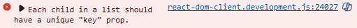
* 배열 또는 반복자의 각 자식 요소는 고유한 `"key"`속성을 가져야 한다.

**map 함수의 활용**
~~~js
const moves = history.map((squares.move)) => { }
~~~
* `map`의 기본 구문은 `map(callbackFn)` 혹은 `map(callbackFn, thisArg)`
* `thisArg`는 내부에서 `this`로 사용할 값을 지정하는데 화살표 함수에서는 생략
* 예제에서는 `callbackFn`만 사용, 화살표 함수가 `callback 함수를 대신함
* squares, move는 화살표 함수의 매개변수
1. `history.map`: `history`는 모든 플레이를 저장하는 배열 이 `history`에 `map`함수를 적용한다는 의미
2. `map`함수는 `history`각각의 요소 `index`를 순회하면서 `squares` 추출
3. 각 요소는 `{ }`안의 실행문을 실행하면서 버튼을 생성
4. 이렇게 생성된 버튼은 `moves`객체(배열)에 다시 저장
5. `move` 최종 렌더링에 사용

**key 선택하기**
* 리스트를 렌더링할 때 React는 렌더링 된 각 리스트 항목에 대한 몇 가지 정보를 저장
* 리스트를 업데이트할 때 React는 무엇이 변경되었는지 확인
* 리스트의 항목은 추가, 제거, 재정렬 또는 업데이트될 수 있음
* React는 컴퓨터 프로그램이기에 사용자의 의도한 바를 알 수 없음
  * 그러므로 리스트의 항목에 `key`프로퍼티를 저장하여 각 리스트의 항목이 다른 항목과 다르다는 것을 구별해야 함
* 만약 데이터베이스에서 데이터를 불러와 사용한다면 데이터베이스 ID를 `key`로 사용할 수 있음
* 리스트가 다시 렌더링 되면 React는 각 리스트의 항목의 `key`를 가져와서 이전 리스트의 항목에서 일치하는 `key`를 탐색
* 현재 리스트에서 이전에 존재하지 않았던 `key`가 있으면 React는 컴포넌트를 생성
* 만약 현재 리스트에 이전 리스트에 존재했던 `key`를 가지고 있지 않다면 React는 그 `key`를 가진 컴포넌트를 제거
* 두 `key`가 일치한다면 해당 컴포넌트를 이동
* `key`는 각 React가 각 컴포넌트를 구별할 수 있도록 하여, 컴포넌트가 다시 렌더링 될 때 React가 해당 컴포넌트의 `state`를 유지할 수 있게 함
* 컴포넌트의 `key`가 변하면 컴포넌트는 제거되고 새로운 `state`와 함께 다시 생성됨

* `key`는 React에서 특별하게 미리 지정된 프로퍼티
* 엘리먼트가 생성되면 React는 `key`프로퍼티를 추출, 반환되는 엘리먼트에 직접 `key`를 저장
* `key`가 `props`로 전달되는 것처럼 보일 수 있지만, React는 자동으로 `key`를 사용해 업데이트할 컴포넌트를 결정
* 부모가 지정한 `key`가 무엇인지 컴포넌트는 알 수 없음
* 동적인 리스트를 만들 때마다 적절한 `key`를 할당하는 것을 강력하게 추천
* 적절한 `key`가 없는 경우 데이터의 재구성을 고려
* `key`가 지정되지 않은 경우, React는 경고를 표시하며 배열의 인덱스를 기본 `key`로 사용
* 배열 인덱스를 `key`사용하면 리스트 항목의 순서를 바꾸거나 항목을 추가/제거할 때 문제가 발생
* 명시적으로 `key={i}`를 전달하면 경고는 사라지지만 배열의 인덱스를 사용할 때 와 같은 문제가 발생하므로 추천X
* `key`는 전역적으로 고유할 필요 없으며 컴포넌트와 해당 컴포넌트의 형제 컴포넌트 사이에서만 고유하면 됨

**시간여행 구현**
* 틱택토 게임의 기록에서 과거의 각 플레이에는 해당 플레이의 일련번호인 고유 ID가 있음
* 플레이는 중간에 순서를 바꾸거나 삭제하거나 삽입할 수 없기 때문에 플레이 인덱스를 `key`로 사용하는 것이 안전
* `Game`함수에서 `<li key={move}>`로 `key`를 추가할 수 있으며, 렌더링 된 게임을 다시 로드하면 React의 `"key"`에러가 사라질 것
~~~js
//Game.js
const moves = history.map((squares, move) => {
  //...
  return (
    <li key={move}>
      <button onClick={() => jumpTo(move)}>{description}</button>
    </li>
  );
});
~~~
* `jumpTo`를 구현하기 전에 사용자가 현재 어떤 단계를 보고 있는지를 추적할 수 있는 `Game` 컴포넌트의 `state`가 하나 더 필요
* 초기값이 0인 `currentMove`라는 새 `state` 변수를 정의
~~~js
//Game.js
const [currentMove, setCurrentMove] = useState(0);
~~~
* `Game` 내부의 `jumpTo` 함수를 수정해서 해당 `currentMove`를 업데이트
* 또한 `currentMove`를 변경하는 숫자가 짝수면 `xIsNext`를 `true`로 설정
~~~js
//Game.js
function jumpTo(nextMove) {
    setCurrentMove(nextMove);
    setXIsNext(nextMove % 2 === 0);
  }
~~~
* `Game`의 `handlePlay`함수 내용 중 두 가지를 변경
* 특정 시점에서 새로운 플레이를 하는 경우 해당 시점까지의 히스토리만 유지
  * `history`의 모든 항목(...전개 구문) 뒤에 `nextSquares`를 추가하는 대신
  `history.slice(0, currentMove + 1)`의 모든 항목 뒤에 추가하여 이전 히스토리의 해당 부분만 유지
* 이동할 때마다 최신 히스토리 항목을 가리키도록 `currentMove`를 업데이트
~~~js
function handlePlay(nextSquares) {
  const nextHistory = [...history.slice(0, currentMove + 1), nextSquares];
  setHistory(nextHistory);
  setCurrentMove(nextHistory.length - 1);
  setXIsNext(!xIsNext);
}
~~~
* 항상 마지막 동작을 렌더링 하는 대신 현재 선택한 동작을 렌더링하도록 `Game`컴포넌트를 수정
`[history.length - 1] -> [currentMove]`
* 게임 히스토리의 특정 단계를 클릭하면 틱택토 보드가 즉시 업데이트되어 해당 단계가 발생한 시점의 보드 모양이 표시

## 2025.04.17 7주차
**state 끌어올리기**
* `handleClick` 함수는 `JavaScript`의 `slice()` 배열 메서드를 사용하여 `squares` 배열의 사본인 `nextSquares`를 생성
* 그 다음 `handleClick` 함수는 `nextSquares` 배열의 첫 번째 `Squares(index [0])`에 `X`를 추가하여 업데이트
* `handleClick` 함수에 업데이트할 `Square`의 index를 나타내는 인수 i를 추가
* `Square`의 `onSquareClick prop`를 JSX에서 직접 `handleCLick(0)`으로 설정할 수 도 있지만 작동하지 않음
  * `handleClick(0)` 호출은 `Board` 컴포넌트 렌더링의 일부가 됨
  * `handleClick(0)`은 `setSquares`를 호출하여, `Board` 컴포넌트의 `state`를 변경하기 때문에 `Board` 컴포넌트 전체가 다시 렌더링
  * 이 과정에서 `handleClick(0)` 다시 실행되기 때문에 무한 루프에 빠지게 됨
* 9개의 서로 다른 함수를 정의하기에는 복잡함
  * 이 대신 `() => handleClick(0)` 화살표 함수 사용.
  ~~~js
  //board.js
    import { useState } from "react";
    import Square from "./Square";

    export default function Board() {
        const [squares, setSquares] = useState([Array(9).fill(null)]);
        function handleClick(i) {
            const nextSquares = squares.slice();
            nextSquares[i] = "X";
            setSquares(nextSquares);
    }
    return (
    //...
    )
  }
  ~~~

* 여기 까지의 과정에서 왼쪽 위 사각형을 클릭하여 `X`를 추가하면
  1. `button`이 Square로 부터 `onClick prop`으로 받은 함수 실행
      * `Square` 컴포넌트는 `Board`에서 해당 함수를 `onSquareClick props`로 받음
      * `Board` 컴포넌트는 `JSX`에서 해당 함수를 직접 정의
      * 이 함수는 0을 인수로 `handleClick`을 호출
  2. `handleClick`은 인수 0 을 사용하여 `squares` 배열의 첫 번째 엘리먼트를 `null`에서 `X`로 업데이트
  3. `Board` 컴포넌트의 `square state`가 업데이트되어 `Board`의 그 모든 자식이 다시 렌더링
      * 인덱스가 0인 `Square` 컴포넌트의 `value prop`이 `null`에서 `X`로 변경  
  4. 최종적으로 사용자는 왼쪽 위 사각형을 클릭한 후 비어있는 사각형이 `X`로 변경된 것을 확인

**`DOM <button>` 엘리먼트의 onClick 어트리뷰트(속성)는 빌트인 컴포넌트이기 때문에 React에서 특별한 의미**
* 사용자 정의 컴포넌트, 예를 들어 사각형의 경우 이름은 사용자가 원하는 대로 지을 수 있음

**불변성의 중요성**
* 일반적으로 데이터를 변경하는 방법 두가지
  1. 데이터의 값을 직접 변경하여 데이터를 변형 
  2. 원하는 변경 사항이 있는 새 복사본으로 데이터를 대체

**원본 데이터를 직접 변형하지 않음으로써의 이점**
* 불변성을 사용하면 복잡한 기능을 훨씬 쉽게 구현
  * 과거 움직임으로 `돌아가기`를 할 수 있는 `시간 여행` 기능 구현 예정
* 기본적으로 부모 컴포넌트의 `state`가 변경되면 모든 자식 컴포넌트가 자동으로 다시 렌더링
  * 변경 사항이 없는 자식 컴포넌트도 포함
* 리렌더링 자체가 사용자에게 보이는 것은 아니지만, 성능상의 이유로 트리의 영향을 받지 않는 부분의 리렌더링을 피하는 것이 좋음
* 불변성을 사용하면 컴포넌트가 데이터의 변경 여부를 저렴한 비용으로 판단

**교대로 두기**
* 기본적으로 첫 번째 이동을 `“X”`로 설정
* 보드 컴포넌트에 또 다른 `state`를 추가

~~~js
//Board.js
export default function Board() {
    const [xIsNext, setXIsNext] = useState(true);
    const [squares, setSquares] = useState([Array(9).fill(null)]);
    function handleClick(i) {
        const nextSquares = squares.slice();
        if (xIsNext) {
          nextSquares[i] = "X";
        } else {
          nextSquares[i] = "O";
        }
        setSquares(nextSquares);
        setXIsNext(!xIsNext);
    }
    return (
    //...
  );
}
~~~

* 여기 까지의 과정에서는 O,X가 덮어씌워지는 상황이 생김
  * 사각형이 이미 채워져 있는 경우 보드의 `state`를 업데이트하기 전에 `handleClick` 함수에서 조기에 `return`

~~~js
//Board.js
function handleClick(i) {
  if (squares[i]) {
    return;
  }
  const nextSquares = squares.slice();
  //...
}
~~~

**승자 결정**
* `X` , `O`  또는 `null`을 반환하는 도우미 함수 `calculateWinner`를 추가
* 승리할 수 있는 경우의 자리를 2차원 배열로 선언
* 선언된 배열 `line`과 `squares`를 비교하기 위한 `for`문을 작성
* 비교를 위해 구조 분해 할당

**구조 분해 할당**
* `비구조화 할당`, `구조화 할당`이라고도 번역되지만 `구조 분해 할당`을 많이 사용
* `구조 분해 할당`은 배열이나 객체의 구조를 해체하여 내부 값을 개별 변수에 쉽게 할당하는 방법
* 이를 통해 코드이 간결성과 가독성 ↑
* `map` 함수에서도 많이 사용되는 방법

~~~js
//Board.js
export default function Board() {
  //...
}

function calculateWinner(squares) {
  const lines = [
    [0, 1, 2],
    [3, 4, 5],
    [6, 7, 8],
    [0, 3, 6],
    [1, 4, 7],
    [2, 5, 8],
    [0, 4, 8],
    [2, 4, 6]
  ];
    for (let i = 0; i < lines.length; i++) {
      const [a, b, c] = lines[i];
      if (squares[a] && squares[a] === squares[b] && squares[a] === squares[c]) {
        return squares[a];
      }
    }
  return null;
}
~~~
* lines는 승리할 수 있는 `squares`의 index 번호
* `for`문을 통해 `lines`의 길이 만큼 비교를 반복
* 구조 분해 할당을 통해 `lines`의 index를 `a,b,c`에 보관
* `squares`의 해당 index 값을 비교하여 3개가 모두 일치하면 값이 `X`인지 `O`인지 `return`
* 일치하는 것이 없으면 `null`을 `return`

**승자 결정**
* Board 컴포넌트의 `handleClick` 함수에서 `calculateWinner(squares)`를 호출하여 플레이어가 이겼는지 확인

~~~js
//Board.js
function handleClick(i) {
  if (squares[i] || calculateWinner(squares)) {
    return;
  }
  const nextSquares = squares.slice();
  //...
}
~~~
* 여기까지의 과정으로 승리 조건이 만족되면 더 이상 게임이 진행되지 않음

**승자 결정**
* 게임이 끝났을 때 플레이어에게 알리기 위해 `“Winner: X”` 또는 `“Winner: O”`라고 표시
* `Board` 컴포넌트에 `status` 구역을 추가
* 게임이 끝나면 `status`는 승자를 표시
* 게임이 진행중인 경우 다음 플레이어의 차례 표시

~~~js
//Board.js
export default function Board() {
  // ...
  const winner = calculateWinner(squares);
  let status;
  if (winner) {
    status = "Winner: " + winner;
  } else {
    status = "Next player: " + (xIsNext ? "X" : "O");
  }

  return (
    <>
      
{status}

      

        // ...
  )
}
~~~

**시간여행 추가**
* 시간을 거슬러 올라가는 기능
* `slice()`를 사용하여 매번 이동할 때마다 `squares` 배열의 새 복사본을 만들고 이를 불변으로 처리
* `squares` 배열의 모든 과거 버전을 저장할 수 있고 이미 발생한 턴 사이를 탐색
* `squares` 배열을 `history`라는 다른 배열에 저장하고 이 배열을 새로운 `state` 변수로 저장

**한번 더 state 끌어올리기**
* 최상위 컴포넌트 Game을 작성
* `history state`를 배치
* `history state`를 `Game` 컴포넌트에 배치하면 자식 `Board` 컴포넌트에서 `squares state`를 제거
* `Square` 컴포넌트에서 `Board` 컴포넌트로 `state`를 끌어올렸던 것처럼, 이제 `Board` 컴포넌트에서 최상위 `Game` 컴포넌트로 `state`를 끌어올릴 수 있다
* `Game` 컴포넌트가 `Board` 컴포넌트의 데이터를 완전히 제어하고 `Board`의 `history`에서 이전 순서를 렌더링하도록 지시

~~~js
//Board.js ---> Game.js 이름 변경
function Board() {
  // ...
}

export default function Game() {
  return (
    

      

        <Board />
      

      

        <ol>{/*TODO*/}</ol>
      

    

  );
}
~~~

## 2025.04.10 6주차
**props를 통해 데이터 전달**
* React의 component architecture를 사용해서 재사용할 수 있는 component를 만들어서 지저분하고 중복된 코드 삭제
  * Board component를 만들고 Square component의 내용 복사
  * Square comonent의 button을 하나만 남기고 모두 삭제
  * Board comopnent의 button을 Square component로 교체
  * App에서 호출하는 component를 Square에서 Board로 교체
  * Square component를 value prop을 전달 받을 수 있도록 수정
  ~~~js
    function Square({ value }) {
      return <button className="square">1</button>;
    }
  ~~~
  * JavaScript 변수가 렌더링 되기 위해 value에 중괄호 추가
  ~~~js
    function Square({ value }) {
      return <button className="square">{value}</button>;
    }
  ~~~

**사용자와 상호작용하는 컴포넌트**
  1. Square 내부에 handleClick 함수 선언
  2. Square 컴포넌트에서 반환되는 JSX 버튼의 props에 onClick을 추가
    * 사각형 클릭시 clicked 라는 로그 출력
    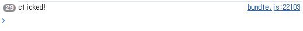

* 이번에는 사각형 컴포넌트가 클릭 된 것을 "기억"하고 "X" 표시로 채우기
  * 컴포넌트는 무언가 "기억"하기 위해 state를 사용
  * React는 상태 기억을 위해 useState라는 Hook을 제공
  * Square의 현재 값을 state에 저장하고 Square가 클릭하면 값이 변경

**useState 사용**
  1. 파일 상단에 useState를 import
  2. Square 컴포넌트에서 value prop을 제거, 대신 useState 사용
  3. Square 컴포넌트 시작 부분에 useState를 호출, value라는 이름의 state 변수를 반환  
      * value 값을 저장하는 변수, setValue는 값을 변경하는 데 사용하는 함수  
      * useState에 전달된 null은 이 state 변수의 초기값으로 현재 value는 null이라는 의미  
      * 앞에서 Square 컴포넌트는 더 이상 props를 사용하지 않게 수정
  4. Board 컴포넌트가 생성한 9개의 Square 컴포넌트에서도 value prop을 제거   
  5. console.log("clicked!"); -> 이벤트 핸들러를 ('X')로 변경  

     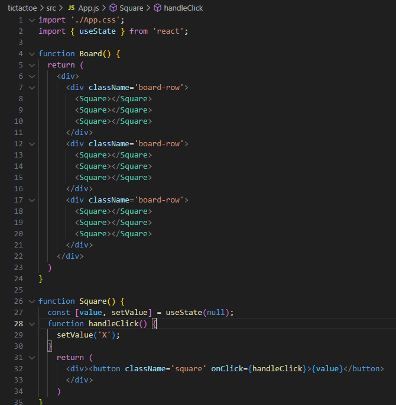
    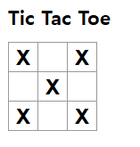  
  
**state 끌어올리기**
* 여기까지의 과정에서 각 Square 컴포넌트는 게임 state의 일부를 기억
* 게임의 승자를 확인할려면 Board가 9개의 Square 컴포넌트 각각의 state를 기억해야 함
  * state를 각 square가 아닌 부모 컴포넌트인 Board에 저장하는 것
  * Board 컴포넌트는 각 Square에 숫자를 전달했을 때와 같이 prop를 전달하여 Square에 표시할 내용을 정할 수 있음
    * 부모 컴포넌트에서 공유 state를 선언
    * 부모 컴포넌트는 props를 통해 해당 state를 자식 컴포넌트에 전달
* Board 컴포넌트를 편집해서 9개 Square에 해당하는 9개의 null의 배열을 기본값으로 하는 state 변수를 square를 선언
* Array(9).fill(null)은 9개의 엘리먼트로 배열을 생성, 각 엘리먼트를 null로 설정
* state 변수 squares와 함수 setSquares 선언 
* 배열의 각 항목은 각 Square 컴포넌트의 값에 해당

**component 분리**
1. component 이름과 동일한 파일 만들기
2. 해당 파일에 코드를 복사하고 export default 키워드를 추가
3. 필요한 component와 useState를 추가
4. App.js에서 해당 코드를 삭제하고, Board component를 import
5. App.js에서 useState의 import를 제거
6. 정상적으로 동작하는지 확인

## 2025.04.03 5주차
**이벤트에 응답**
* component 내부에 event handler 함수를 선언하면 event에 응답할 수 있음
* onclick={handclick}의 끝에는 소괄호`()`가 없음
* 함수를 호출하지 않고 전달하면 끝
* React는 사용자가 버튼을 클릭할 때 이벤트 핸들러를 호출

**화면 업데이트**
* component가 특정 정보를 '기억'해 두었다가 표시하기를 원하는 경우가 있다
  * 예를 들면 버튼이 클릭 된 횟수
* 이렇게 하려면 component에 state를 추가
  * React에서 useState를 import
    * component 내부에 state 변수 선언 가능

**Hook**
* use로 시작하는 함수를 `Hook` 이라 한다.
* useState는 React에서 제공하는 내장 Hook
* 다른 내장 Hook은 API 참고서 에서
* 기존의 것들을 조합해 자신만의 Hook을 만들 수 있음

**Hook 사용 규칙**
* 최상위에서만 호출
* if, for, while등의 블록 내부에서 호출 불가능
  * 조건문 내부에서 호출 시 실행 순서가 달라질 수 있음
* React 함수형 component 또는 사용자 hook 내부에서만 사용 가능
* 일반적인 JavaScirpt 함수에서 useState, useEffect 등의 Hook 사용 불가능

**Hook 제한이 필요한 이유**
* React 동작을 예측 가능하고 안정성을 높이기 위해
  1. rendering 순서를 보장하기 위해
  2. 불필요한 사이드 이펙트 방지

**function형 컴포넌트에서만 Hook을 사용하는 이유**
* React는 component의 상태 관리(lifecycle)와 로직을 더 간결하기 위해 Hooks를 도입
  * 따라서 React는 function형 component를 권장

**5주차 실습**

~~~js
//CountState.js
import { useState } from "react";

export default function CountState() {
    const [count, setCount] = useState(0);

    function handleClick() {
        setCount(count + 1);
    }

    return (
        

            <button onClick={handleClick}>
                Clicked {count} times
            </button>
        

    );
}
~~~
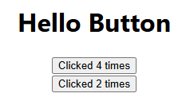

~~~js
//CountState2.js
function CountState2({ count, onClick }) {

    return (
      

          <button onClick={onClick}>
              Clicked {count} times
          </button>
      

    );
}
~~~
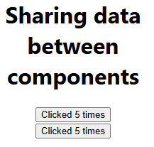

## 2025.03.27 4주차
**component의 생성 및 중첩**
* component는 고유한 로직과 모양을 가진 UI의 일부
* component는 버튼처럼 작거나 전체 페이지처럼 클 수도 있음
* component는 마크업을 반환(return)하는 JavaScript함수

**export default 키워드**
* 파일 내의 component중 기본 component를 지정
* 이 키워드의 사용도 JavaScript문법

**export default와 export의 차이**
* Named Exports(export)
  * 하나의 파일 안에 여러 개의 component가 있을 때 사용
  * component를 사용하는 쪽에서는 component의 정확한 이름을 명시해야 함
* Default Exports(export default)
  * 하나의 파일 안에 하나의 component만 내보내는 경우
  * component를 사용하는 쪽은 자유롭게 이름을 쓸 수 있음

**JSX로 마크업 작성**
* 작성된 코드의 문법은 JSX이다.
* 반드시 사용해야 하는 것은 아니지만 React 프로젝트에서는 편의성을 위해 사용한다.
* JSX는 HTML보다 더욱 엄격한 문법을 적용
* JSX에서는 ` ` 같이 싱글 태그라도 태그를 닫아야 한다.
* 여러 개의 component를 `
...
` , `bean<>...</>` wrapping 해야 한다.

**스타일 추가**
* React에서는 className으로 CSS클래스 지정
* className은 HTML의 CSS속성과 동일한 방식으로 동작
* CSS 규칙은 별도의 CSS파일에 작성. React는 CSS파일을 추가하는 방법을 규정하지 않는다.

**데이터 표시**
* JSX를 사용하면 JavaScript에 마크업을 넣을 수 있다.
* JSX 코드 내에서 JavaScript로 탈출하여 변수나 표현식을 사용하는 것 
  * 이 방법은 "Escape Back"
* {} 중괄호를 사용해서 변수나 표현식을 사용자에게 표시하도록 하는 것

**조건부 렌더링**
* React에서 조건문을 작성하는 데에는 특별한 문법이 필요없음.
* 일반적인 JavaScript 코드를 작성할 때 사용하는 것과 동일한 방법을 사용
  * if-else 문
  * 삼항 연산자
  * 이항 연산자

**리스트 렌더링**
* 컴포넌트 리스트를 렌더링하기 위해서는 `for()문 및 map()함수`와 같은 JavaScript 기능을 사용
* <li>에 key 속성이 있다.
* 목록을 사용할 때 각 항목에 대해 고유하게 식별하는 문자열 또는 숫자를 전달해야 한다.
* 항목을 삽입, 삭제 또는 재정렬할 때 어떤 일이 일어났는지 알기 위해 key를 사용
  * 이 것을 `key props`라 한다.

**4주차 실습**
~~~js
//About.js
export default function AboutPage() {
    return (
        <>
            <h1>About Page</h1>
            
Hello!!!

        </>
    )

}
~~~
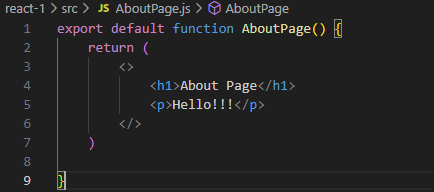

~~~js
//MyButton.js
export default function MyButton() {
    return (
      <button>I'm My button component</button>
    )
  }
  
~~~
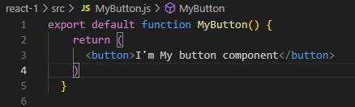

~~~js
//ButtonLib.js
function Button1() {
    return (
        <button>Button1</button>
    )
}

function Button2() {
    return (
        <button>Button2</button>
    )
}

function Button3() {
    return (
        <button>Button3</button>
    )
}

export {Button1, Button2, Button3}
~~~
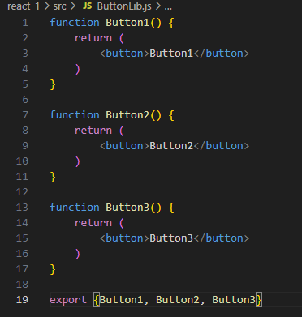

~~~js
//App.js
import MyB from "./MyButton"
import { Button1, Button3 } from "./ButtonLib"
import AP from "./AboutPage"
import Profile from "./Profile"
import './App.css'
import SL from "./ShoppingList"

export default function App() {
  return (
    

      <h1>Hello React</h1>
      <MyB />  
      <Button1 />&nbsp;
      <Button3 />
      <AP />
      <Profile />
      <SL />
    

  )
}
~~~
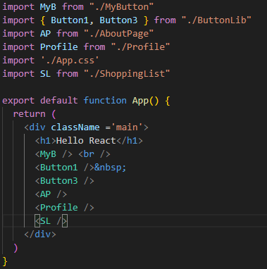

**App.js 실행결과**
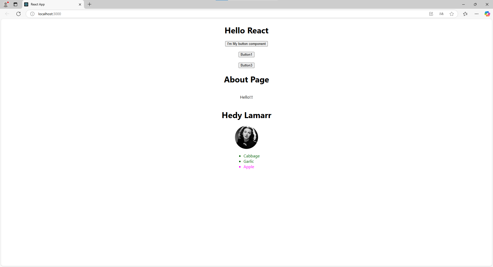

## 2025.03.20 3주차

### React project의 구조 및 역할

**node modules**
* 초기 node module 및 새로 설치하는 패키지가 저장

**public**
* 정적(static)파일을 저장하는 디렉토리
* build 후 배포할 html, CSS, JavaScript등이 보관되는 곳

**public/index.html**

**src**
* React 프로젝트의 주요 코드가 위치하는 디렉토리

**src/App.js**
* 메인 component로 필요한 sub component를 모아서 관리

**src/app.js**
* App.js에 적용되는 스타일을 정의하는 스타일 파일

**src/index.js**
* React 앱의 진입 점(entry point)으로 최종 렌더링 되는 곳

**src/index.css**
* 전역 스타일을 정의하는 스타일 파일

**의존성 관리와 package.json**
* package.json은 패키지의 의존성을 관리하는 파일
* 의존성(Dependency) 이란, 하나의 소프트웨어가 다른 소프트웨어(라이브러리,패키지, 모듈 등)에 의존하여 동작하는 관계를 말한다.
* 프로젝트에 사용된 각종 패키지 등의 버전을 동일하게 유지하기 위한 것

**의존성을 관리하는 이유**
* 손쉬은 설치 및 업데이트
* 일관된 개발 환경 유지
* 중복 설치 방지

**package.json을 유지해야 하는 이유**
* 프로젝트 의존성 정보 제공
* 버전 범위 설정 가능
* 스크립트와 메타데이터 저장
* 새로운 패키치 설치 및 관리

**node module의 재설치**
* 프로젝트에 오류나 의존성 등의 문제가 생겼을 경우
    1. node_modules 폴더와 package-lock.json 파일을 삭제
    ~~~bash
    $ rm -rf node modules package-lock.json
    ~~~
    2. npn 패키지의 임시 저장소인 cache를 초기화
     ~~~bash
    $ npm cache clean --force //force 옵션을 사용
    ~~~
    3. 패키지를 다시 설치
     ~~~bash
    $ npm install
    ~~~

**package-lock.json을 삭제하는 이유**
* package-lock.json이 손상되었거나, 잘못된 의존성이 있을 때
* 최선 버전의 패키지를 다시 받고 싶을 때
* 팀 프로젝트에서 다른 팀원이 이상한 상태로 업데이트 했을 때

**React에서의 component**
* React는 component 단위로 개발하여 레고 조립하듯 앱을 완성
* component는 작은 기능을 실행할 수 있는 하나의 모듈

**component를 작성하는 JavaScript&Markup**  
* JavaScript
    * React component는 JavaScript함수
    * 조건을 사용할때는 if문
    * 목록 표시는 map()
    * JavaScript를 이미 이해하고 있다면 용이하다.
* MarkUp
    * React에서 사용되는 MarkUp을 JSX(JavaScript Syntax eXtension)이라 한다.
    * JSX는 React를 통해 대중화된 JavaScript 확장 문법
    * JSX MarkUp을 렌더링 로직과 가까이 두면 component 쉽게 생성, 관리, 삭제를 할 수 있다.  

**상호작용 기능 추가**  
* React component는 데이터 수신, 화면에 표시되는 내용 반환
* 사용자의 입력을 받아 새로운 데이터를 component에 전달 가능
* 이때 React는 상호작용을 통해 새 데이터를 화면에 업데이트
* 두 개의 component를 결합해 또 다른 component를 만들어낼 수 있다.

**상호작용 예시**
~~~js
import { useState } from 'react';

function SearchableVideoList({ videos }) {
  const [searchText, setSearchText] = useState('');
  const foundVideos = filterVideos(videos, searchText);
  return (
    <>
      <SearchInput
        value={searchText}
        onChange={newText => setSearchText(newText)} />
      <VideoList
        videos={foundVideos}
        emptyHeading={`No matches for “${searchText}”`} />
    </>
  );
}
// SearchInput과 VideoList가 결합해 또 다른 component를 만들었다.
~~~

**full-stack 개발을 돕는 React Framework**
* React는 라이브러리이기 때문에 component 조합할 수 있지만, 라우팅 및 데이터 가져오기 방법등을 규정하지 않는다.
* React 전체 앱을 빌드할려면 Next.js 또는 Remix와 같은 full-stack React Framework을 사용하는 것이 좋다.

**플랫폼을 가리지 않는 React**
* React를 사용하면 동일한 기술을 사용해 웹 앱과 네이티브 앱 모두 구축 가능
* 각 플랫폼의 강점을 활용하여 모든 플랫폼에 어울리는 인터페이스 구현 가능
* 크롬, 파이어폭스, 사파리 등 각기 다른 웹에서도 본질에 충실
* 안드로이드, IOS등 운영체제에 관계없이 진정한 네이티브 UX를 실현

## 2025.03.13 2주차

**Node.js?**
* 2009년 발표, 라이언 달(Ryan dahl)이 개발  
* Apache는 블로킹(Blocking) 방식으로 동작. 이를 대체하기 위한 목적
* 비동기 방식(Asynchronus)의 서버가 필요하다고 판단,개발
* 개발은 python에서 javascript로 전환
* 크롬 브라우저가 주목 받고 있었기에 V8 엔진 사용

**React?**
* javascript UI를 표방하며 2013년 공개
* 18.2.0버전까지 javascript 라이브러리임을 강조
* javascript 라이브러리에서 웹과 앱 UI의 표준 라이브러리로 변신해가는 중

**Node.js 설치**

**프로젝트 만들기**

**서버 시작**
* 서버 시작은 "npm start"
* 서버 중지는 서버가 시작된 상태에서 "ctrl + c"

 
