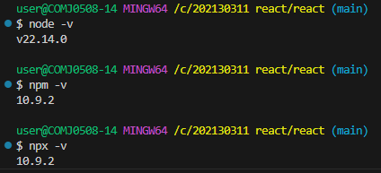
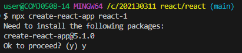
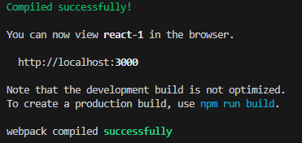

# 202130311 안상하 

## 2025.03.20 3주차

### React project의 구조 및 역할

**node_modules/**
* 초기 node module 및 새로 설치하는 패키지가 저장

**public/**
* 정적(static)파일을 저장하는 디렉토리
* build 후 배포할 html, CSS, JavaScript등이 보관되는 곳

**public/index.html**

**src/**
* React 프로젝트의 주요 코드가 위치하는 디렉토리

**src/App.js**
* 메인 component로 필요한 sub component를 모아서 관리

**src/app.js**
* App.js에 적용되는 스타일을 정의하는 스타일 파일

**src/index.js**
* React 앱의 진입 점(entry point)으로 최종 렌더링 되는 곳

**src/index.css**
* 전역 스타일을 정의하는 스타일 파일

**의존성 관리와 package.json**
* package.json은 패키지의 의존성을 관리하는 파일
* 의존성(Dependency) 이란, 하나의 소프트웨어가 다른 소프트웨어(라이브러리,패키지, 모듈 등)에 의존하여 동작하는 관계를 말한다.
* 프로젝트에 사용된 각종 패키지 등의 버전을 동일하게 유지하기 위한 것

**의존성을 관리하는 이유**
* 손쉬은 설치 및 업데이트
* 일관된 개발 환경 유지
* 중복 설치 방지

## 2025.03.13 2주차

**Node.js?**
* 2009년 발표, 라이언 달(Ryan dahl)이 개발  
* Apache는 블로킹(Blocking) 방식으로 동작. 이를 대체하기 위한 목적
* 비동기 방식(Asynchronus)의 서버가 필요하다고 판단,개발
* 개발은 python에서 javascript로 전환
* 크롬 브라우저가 주목 받고 있었기에 V8 엔진 사용

**React?**
* javascript UI를 표방하며 2013년 공개
* 18.2.0버전까지 javascript 라이브러리임을 강조
* javascript 라이브러리에서 웹과 앱 UI의 표준 라이브러리로 변신해가는 중

**Node.js 설치**

**프로젝트 만들기**

**서버 시작**
* 서버 시작은 "npm start"
* 서버 중지는 서버가 시작된 상태에서 "ctrl + c"

 
